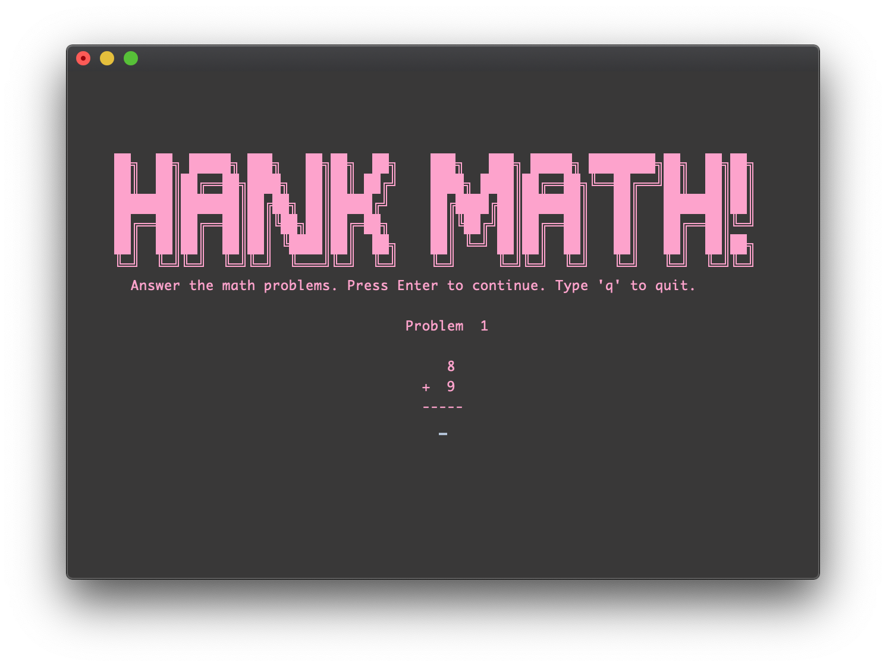
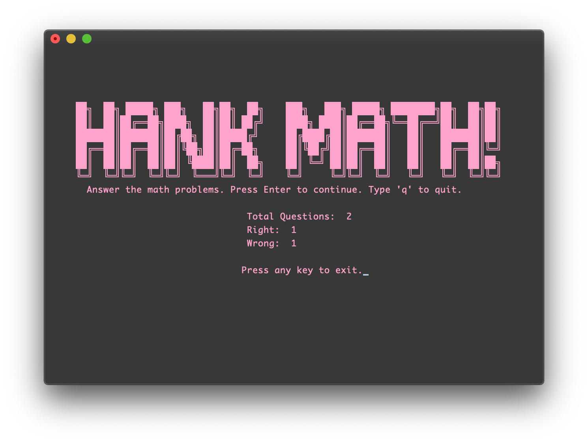
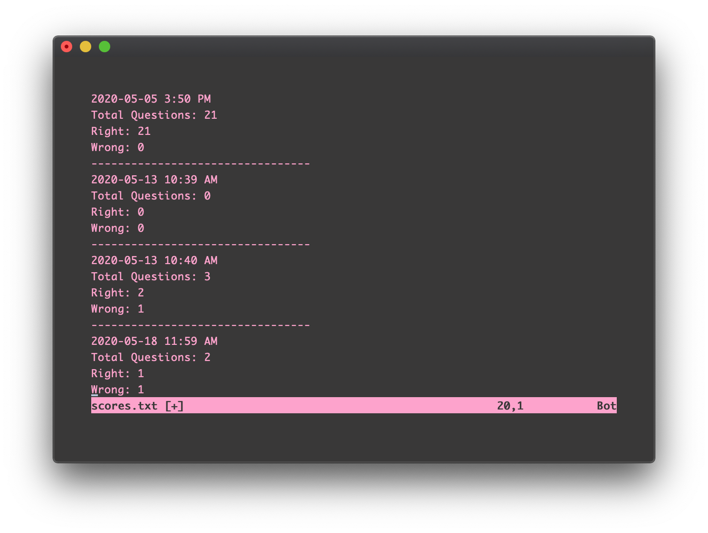

# Hank Math!

This is a simple Python program I wrote for my son to practice math problems (and for me to practice Python). It randomly selects two integers between a defined range, gets the user's input to the problem, and records all the variables of the problem(s) in object instances to show a final score. If you want to play it, it should run fine in most terminals.

## Screenshots

Correct answer

Incorrect answer

Results

Score tracking - Hank Math creates/appends a separate .txt file with timestamp and totals of most recent playthrough.
